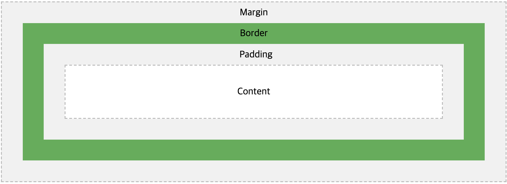

# kakao-clone

- [[이론+실전] 코코아톡 클론 코딩](https://academy.nomadcoders.co/p/kakaoclone_total) - HTML과 CSS를 이용하여, kakao clone하는 수업

---

## HTML(Hyper Text Markup Language)

### 1. HTML은 무엇인가 ?

- 웹사이트에서 각 요소가 무엇을 뜻하는지 알려주는 언어

- tag를 이용해서 작성

### 2. tag

- tag의 생김새 - <name attribute="value">Content</name>
- 열린 tag와 닫힌 tag가 항상 쌍으로 있어야 한다.
- example

```html
<div>hello</div>
<a href="http://google.com">Go to google</a>
```

### 3. html 문서 작성

```html
<!DOCTYPE html>
<html>
  <head>
    <title>This is my title</title>
  </head>
  <body>
    <h1>Big Title</h1>
    <h6>Small Title</h6>
  </body>
</html>
```

- `<!DOCTYPE html>` - 브라우저에게 html 문서임을 알려준다.
- `<head></head>` - 브라우저에게 웹사이트에 관한 필요한 정보를 제공
- `<body></body>` - 사람들이 읽는 컨텐츠 제공

### 4. meta tag

```html
<!DOCTYPE html>
<html>
  <head>
    <meta charset="utf-8" />
    <meta name="description" content="Welcome to HTML" />
    <meta name="author" content="Ian" />
    <title>This is my title</title>
  </head>
  <body>
    <h1>Big Title</h1>
    <h6>Small Title</h6>
  </body>
</html>
```

- meta tag - 추가정보라는 의미
- `<meta charset="utf-8">` - 브라우저에게 작성된 문서가 어떤 언어로 작성되었는지 알려준다.
- `<meta name="description" content="Welcome to HTML" />` - 검색엔진에서 검색할 때, 요약되서 나오는 내용
- `<meta name="author" content="Ian" />` - 브라우저에게 문서 작성자를 알려준다.

### 5. semantic tag와 non-semantic tag

- [semantic](https://www.w3schools.com/html/html5_semantic_elements.asp) - 의미가 있는 tag (header, nav, section, article, footer 등등..)

```html
<html>
  <head>
    <meta charset="utf-8" />
    <meta name="description" content="Welcome to HTML" />
    <meta name="author" content="Ian" />
    <title>This is my title</title>
  </head>
  <body>
    <header>
      <h1>Big Title</h1>
    </header>
    <section>
      <div>Whatever</div>
    </section>
    <footer>
      <span>Something else</span>
    </footer>
  </body>
</html>
```

- non-semantic - 아무 의미가 없는 tag (div, span 등등...)

```html
<!DOCTYPE html>
<html>
  <head>
    <meta charset="utf-8" />
    <meta name="description" content="Welcome to HTML" />
    <meta name="author" content="Ian" />
    <title>This is my title</title>
  </head>
  <body>
    <h1>Big Title</h1>
    <div>Whatever</div>
    <span>Something else</span>
    <h6>Small Title</h6>
  </body>
</html>
```

### 6. tag에 이름을 주는법(id 와 class)

```html
<html>
  <head>
    <meta charset="utf-8" />
    <meta name="description" content="Welcome to HTML" />
    <meta name="author" content="Ian" />
    <title>This is my title</title>
  </head>
  <body>
    <section>
      <header id="headerNumberOne" class="defaultHeader">
        <h1>Big Title</h1>
      </header>
    </section>
    <div>
      <header id="diffrentHeader" class="defaultHeader">
        Title of the unkown container
      </header>
    </div>
  </body>
</html>
```

- css를 사용하기 위해서 id와 class를 사용한다.

|        |                    id                     |                 class |
| ------ | :---------------------------------------: | --------------------: |
| 사용성 | element마다 한개만 가져야 한다. 고유하다. | 여러개 사용 가능하다. |

## CSS(Cascading Style Sheets)

### 1. CSS Syntax

```css
selector(tag, id, class) {
  property-name: value;
}
```

- selector는 tag, id, class가 될 수 있다.
- property와 value는 소문자
- value끝에는 세미콜론(;)으로 끝나야 한다.

### 2. CSS 사용방법

- Inline Styles - tag에 직접 style property로 css를 주는 방식

  ```html
  <span style="color: red;">text<span></span></span>
  ```

- Internal Style Sheet - html문서 head tag 사이에 style tag를 넣고, css를 작성하는 방식

  - index.html

  ```html
  <!DOCTYPE html>
  <html>
    <head>
      <title>This is my title</title>
      <style>
        h1 {
          color: red;
        }

        #small_title {
          font-size: 20px;
        }

        .container {
          background-color: blue;
        }
      </style>
    </head>
    <body>
      <h1>Big Title</h1>
      <h6 id="small_title">Small Title</h6>
      <div class="container">a</div>
      <div class="container">b</div>
    </body>
  </html>
  ```

  - 똑같은 css를 여러개의 html파일에 사용해야한다고 했을 때, css를 모든 html 파일에 복사해야하기 때문에 불편하다.
  - html 파일이 지저분하다.
  - 같은 selector의 css를 변경할 때, 여러 html 파일을 변경해야 하기 때문에 css가 적용이 안되는 부분도 생길 수 있다.

- External Style Sheet - html문서 head tag 사이에 link tag를 통해서 css를 불러오는 방식

  - index.html

  ```html
  <!DOCTYPE html>
  <html>
    <head>
      <title>This is my title</title>
      <link href="index.css" rel="stylesheet" />
    </head>
    <body>
      <h1>Big Title</h1>
      <h6 id="small_title">Small Title</h6>
      <div class="container">a</div>
      <div class="container">b</div>
    </body>
  </html>
  ```

  - index.css

  ```css
  h1 {
    color: red;
  }

  #small_title {
    font-size: 20px;
  }

  .container {
    background-color: blue;
  }
  ```

  - 같은 selector의 css를 변경할 때, css 파일 하나만 수정하면 되기때문에 편하다.

### 3. Box Model



- Box Model의 4 요소

  - Contents
  - Border

    - 사용법

      - width, style, color로 css를 줄 수 있다.

      ```css
      .box {
        border-width: 5px;
        border-style: dashed;
        border-color: blue;
      }
      ```

      - 요약해서 쓰는 방식(width, style, color 순서)

      ```css
      .box {
        border: 5px dashed blue;
      }
      ```

  - Padding - Border 안쪽에 있는 간격

    - 사용법

      - padding을 방향에 따라 padding-top, padding-right, padding-bottom, padding-left로 각각 줄 수 있다.

      ```css
      .box {
        padding-top: 50px;
        padding-right: 40px;
        padding-bottom: 30px;
        padding-left: 20px;
      }
      ```

      - 요약해서 쓰는 방식(시계방향 순이다. top, right, bottom, left)

      ```css
      .box {
        padding: 50px 40px 30px 20px;
      }
      ```

      - 상하좌우가 같을 경우((top, bottom)px (left, right)px 순서)

      ```css
      .box {
        padding: 50px 30px;
      }
      ```

  - Margin - Border 바깥에 있는 간격(위의 padding 사용법과 동일하다.)
  - [example](https://www.w3schools.com/css/tryit.asp?filename=trycss_boxmodel)

### 4. Display

- none - 차지하던 영역이 사라진다.
- block - 옆에 다른 element가 위치하는 것을 허용하지 않음. width와 height가 존재
- inline-block - block안에 element가 붙어서 존재한다. block안에 박스가 너무많아서 박스가 다 채워지면, 밑에줄로 박스들이 넘어간다. width와 height가 존재
- inline - text라고 생각하면 된다. box는 사라진다. width와 height를 줄 수 없음.
- [example](https://www.w3schools.com/cssref/tryit.asp?filename=trycss_display)

### 5. Position

- static(default)
- fixed - 위치를 고정. 스크롤해도 사라지지않음 (top, bottom, left, right 값을 줄 수 있다. width와 height를 설정해줘야한다.)([exmaple](https://www.w3schools.com/css/tryit.asp?filename=trycss_position_fixed))
- absolute - 어디에든 붙일 수 있지만, 스크롤해도 고정되진 않음. 부모 박스에 상응해서 포지션(top, bottom, left, right)이 결정된다. 부모박스를 만들어 주려면 부모박스에 position: relative를 주면 된다. ([example](https://www.w3schools.com/css/tryit.asp?filename=trycss_position_absolute))

### 6. Flexbox

- [example](https://www.w3schools.com/css/css3_flexbox.asp)

- [flexbox game](https://flexboxfroggy.com/#ko)

### 7. Pseudo Selector

- tag나 id, class를 사용하지 않고 element를 선택하는 방법
- 레이아웃이 복잡 할 때, 사용하면 유용하다.
- [example](https://www.w3schools.com/css/css_pseudo_elements.asp)

### 8. Pseudo class

- [example](https://www.w3schools.com/css/tryit.asp?filename=trycss_link)

### 9. box-sizing, border-box

- border-box에서 padding을 주면?

  - 넓이를 원래 생각한것보다 padding만큼 줄여야 한다. 왜냐하면 넓이가 준것에 padding값이 더해져서 box의 넓이가 더 커지기때문이다.

- [example](https://www.w3schools.com/css/css3_box-sizing.asp)

## 3, Advanced CSS

### 1. Transitions

- transition은 hover, focus, active에서 효과적으로 적용이 된다.

- 사용법

```
selector {
  transition: <property> <duration> <timing-function>;
}
```

- [example](https://www.w3schools.com/css/tryit.asp?filename=trycss3_transition5)

- transition을 여러 속성을 주려면? 콤마(,)로 구분해서 똑같이 반복하면 된다. (단, 모든 css속성에 transition을 주려면 property에 all을 쓰면 된다.)

```
selector {
  transition: <property> <duration> <timing-function>, <property> <duration> <timing-function>, ...
}
```

### 2. Transformations

- [transformation](https://www.w3schools.com/cssref/css3_pr_transform.asp) - html문서의 element들을 변경, 모습이 변하는 효과
- [example](https://www.w3schools.com/cssref/tryit.asp?filename=trycss3_image_gallery)

### 3. Animations

- hover같은거 없이 transition같은것들이 계속 발생하려면? [animation](https://www.w3schools.com/cssref/css3_pr_animation.asp)을 사용해라!

- 사용법

```
// 1. from to를 이용
@keyframe <animation name> {
  from {
    변화가없는상태의 css
  }

  to {
    변화된모습의 css
  }
}

// 2. 0%-50%-100% 사용
@keyframe <animation name> {
  0% {
    변화가없는상태의 css
  }

  50% {
    변화된모습의 css
  }

  100% {
    변화가없는상태의 css
  }
}

selector {
  animation: <duration> <animation name> <timing-function> <iteration-count>;
}
```

- [example](https://www.w3schools.com/cssref/tryit.asp?filename=trycss3_animation)

### 4. Media Queries

- 브라우저가 큰지 작은지 알아내는 방법 - [media query](https://www.w3schools.com/cssref/css3_pr_mediaquery.asp)

  - 왜 필요한가? 데스크탑, 태블릿, 모바일등 여러가지 css를 대응하기 위해서 필요하다. 즉, 반응형 웹디자인을 하기 위해서 필요하다.

- 사용법

```
@media only|not <media type> and (media feature) {
  CSS스타일코드
}
```

-[example](https://www.w3schools.com/cssref/tryit.asp?filename=trycss3_media_bg)
